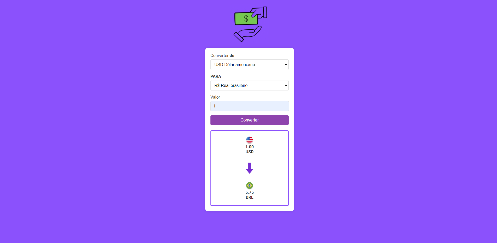

💱 Conversor de Moedas
Este projeto é uma página web para converter valores entre diferentes moedas, utilizando a API ExchangeRate-API. Apresenta uma interface intuitiva, ícones de moedas, e um indicador visual da conversão.

📄 Descrição
A página permite aos usuários converter valores entre BRL, USD, EUR, GBP e Bitcoin. A aplicação obtém as taxas de câmbio mais recentes da ExchangeRate-API e exibe o resultado da conversão com ícones representativos das moedas e uma seta indicando a direção da conversão.

🚀 Tecnologias Utilizadas

HTML5
CSS3
JavaScript
📂 Estrutura do Projeto

index.html - Arquivo principal do projeto.
styles.css - Arquivo de estilos do projeto.
script.js - Arquivo de scripts JavaScript.
img/ - Pasta contendo as imagens das moedas e a seta.

🖼️ Screenshot

🎨 Estilos CSS
Os estilos são definidos no arquivo styles.css e incluem classes para estilizar o corpo do documento, o contêiner principal, os inputs, os botões, e o resultado da conversão.

📜 Scripts JavaScript
Os scripts são definidos no arquivo script.js e incluem funções para buscar as taxas de câmbio da API e realizar a conversão dos valores.

📧 Contato
Se você tiver alguma dúvida ou sugestão, sinta-se à vontade para entrar em contato comigo através do LinkedIn ou visitar meu portfólio.
